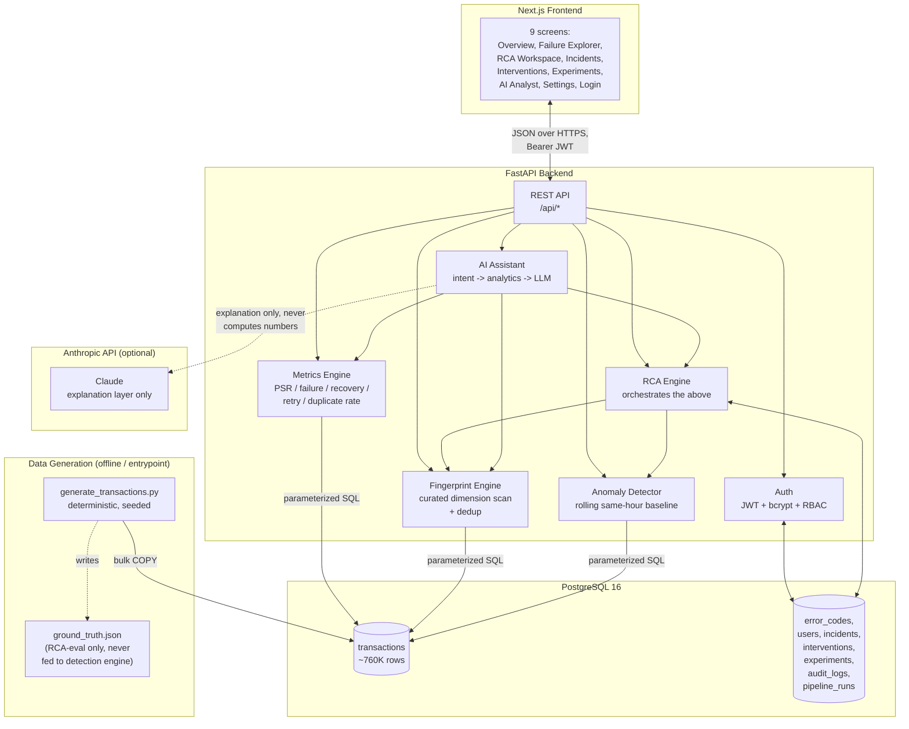
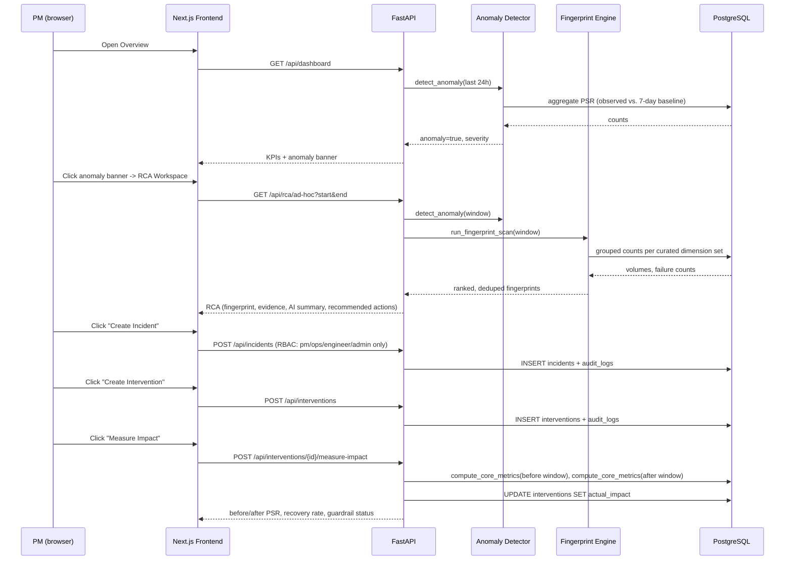

# Architecture

## System overview

## Why this shape

**PostgreSQL does the heavy aggregation; Pandas shapes and ranks it.** The `transactions` table
holds ~760K rows. Rather than pulling that into memory for every dashboard request, `GET`
endpoints run parameterized SQL aggregations (counts, sums, group-bys) directly against
Postgres, and Pandas is used where the TRD calls for it: merging observed-vs-baseline
comparisons, computing contribution scores, and deduplicating nested fingerprints — logic that's
awkward to express as a single SQL query but fast once the heavy counting is already done in the
database. See `docs/decisions.md` D18.

**The RCA engine is an orchestrator, not a new computation.** `run_rca()` calls
`detect_anomaly()` (rolling baseline comparison) and, only if an anomaly is found,
`run_fingerprint_scan()` (dimension-combination search). Both of those exist and are tested
independently — RCA composes them and adds evidence assembly, severity, and recommended
actions on top. Nothing in the RCA path recomputes a number a lower-level engine already
computed.

**The AI Assistant never computes anything itself.** `parse_intent()` is rule-based keyword
matching — deliberately not an LLM call — so which analytics function runs is fully
deterministic before any model is involved (D36). The LLM (when configured) is handed only the
already-validated structured result and instructed never to introduce a number that isn't in
it; when no LLM key is configured, a template fallback produces the same shape of grounded
answer (D38).

**Auth is a bearer-token API, not session cookies.** The JWT carries `sub` (email) and `role`;
`require_role(...)` builds a role-checking dependency reused across every write endpoint. This
keeps the API equally usable from the Next.js frontend, `/docs` Swagger UI, or a future mobile
client (D29).

## Demo-scenario data flow

This is the exact path exercised by the Playwright `demo-scenario.spec.ts` suite and the
backend's `test_incidents_lifecycle.py`:

## Component responsibilities

| Component | Responsibility | Key files |
|---|---|---|
| Synthetic Generator | Deterministic transaction generation, injected anomaly, retries/duplicates | `data/generator/generate_transactions.py` |
| Metrics Engine | PSR, failure rate, recovery rate, retry rate, duplicate rate, value at risk | `backend/app/analytics/metrics.py` |
| Fingerprint Engine | Curated multi-dimension search, contribution scoring, dedup | `backend/app/analytics/fingerprint.py` |
| Anomaly Detector | Rolling same-hour-of-day baseline comparison, severity assignment | `backend/app/analytics/anomaly.py` |
| RCA Engine | Orchestration, evidence assembly, recommended actions | `backend/app/analytics/rca.py` |
| AI Assistant | Intent detection, routing, LLM explanation with template fallback | `backend/app/ai/` |
| Auth / RBAC | JWT issuance/verification, 6-role permission matrix | `backend/app/core/security.py`, `backend/app/core/deps.py` |
| API | REST endpoints, request validation, error normalization | `backend/app/api/routes/` |
| Frontend | 9 screens, typed API client, auth context | `frontend/app/`, `frontend/lib/` |

## What this diagram deliberately leaves out

Per the TRD's own scoping (Section 17), Kafka/streaming, a data warehouse, and advanced ML
anomaly models are **not** part of this architecture — the MVP is
`Generator -> PostgreSQL -> Pandas Analytics -> FastAPI -> Next.js`, and that's what's actually
built and tested. The roadmap section of the PRD (Section 31) describes where streaming and
predictive detection would fit in a V2/V3, but adding them here would be scope not requested by
the current build phase, not a missing piece of this MVP.
